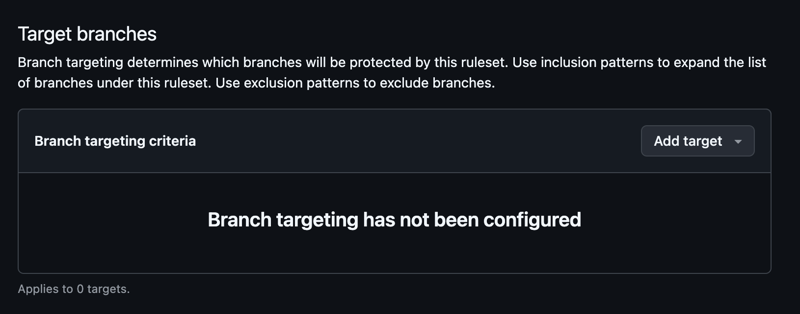

# Protect a Github Repo branch

1. Go to your `git-exploration` repo on Github and click the Settings tab.
1. On the left navigation click the "Branches" tab. You should see a message like this:
   
1. Click the "Add branch ruleset" button
1. Name your ruleset
   
1. In the target branches section click Add Target and select add default branch
   
   
1. Check the "Require a pull request before merging" checkbox
   
1. Scroll to the bottom and click "Create" to save the rule
