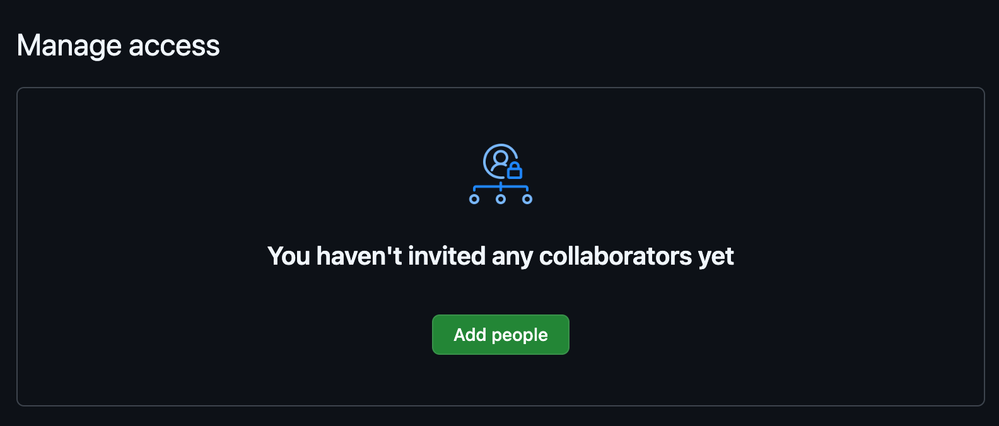
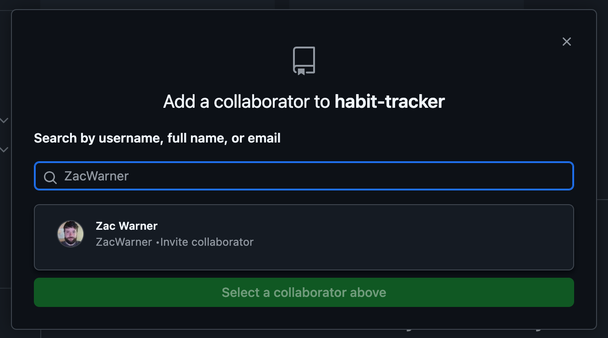
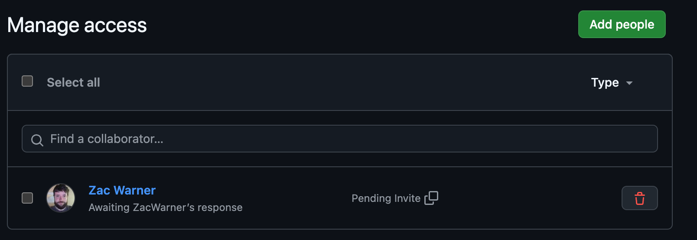

# Add collaborators

In order to share access to a github repository you have to add collaborators. Each group should have only one shared repository. One memeber from each group should create the repo and add the others as collaborators. If the others would like a copy of the project to show up in the github profile, they can fork a copy.

Here is how to add collaborators:

1. Go to the Settings tab of your repository and click the "Collaborators" link in the left side menu.
   
1. Scroll down the "Manage Access" section and click the "Add People" button
   
1. Use your teammates' github handles to search for them. In this example, I typed
   in Zac's github handle.
   
1. Once you select a user, they will be sent an invite.
   
1. The invited team member will see a notification to accept the invitation when they sign in to Github
1. Once they accept, they will have write access to this repository.
