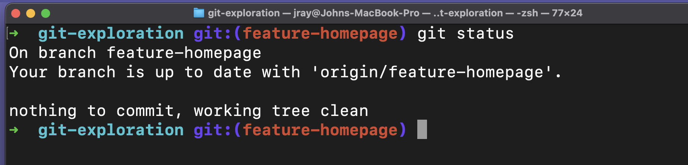
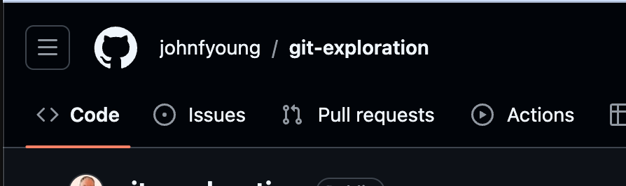
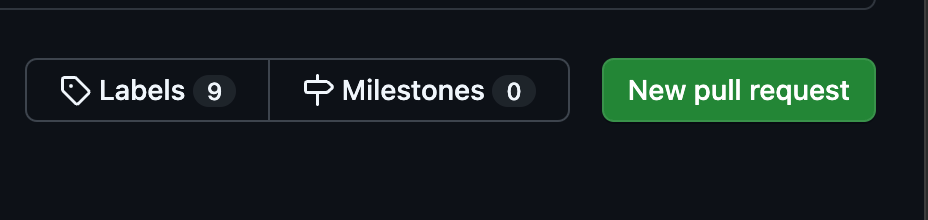
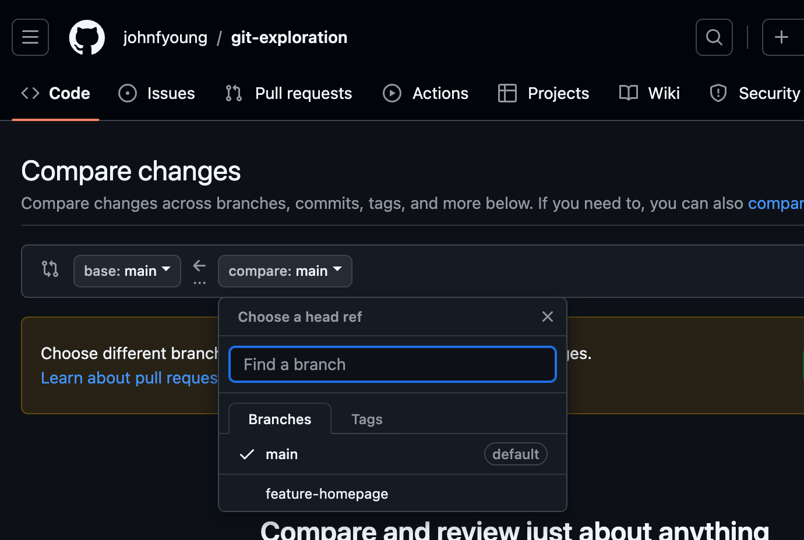
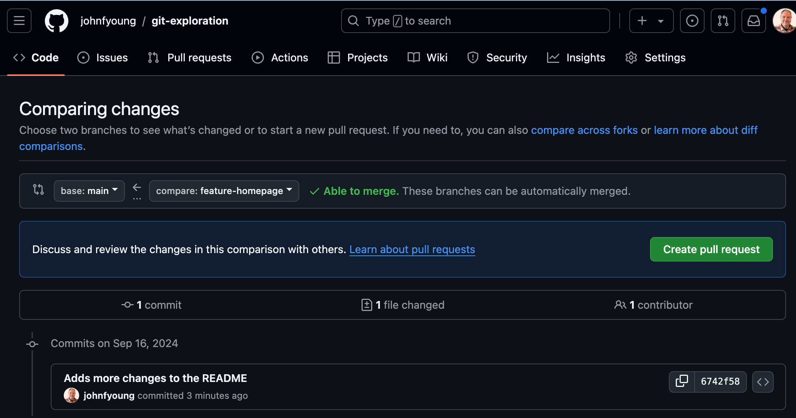
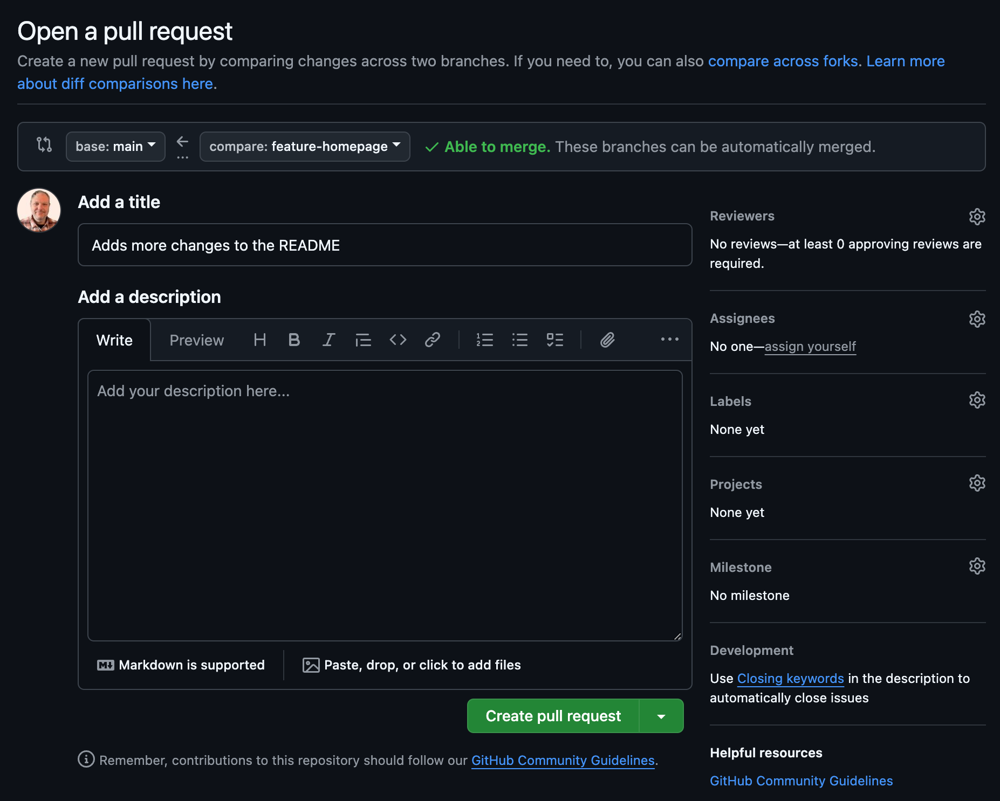
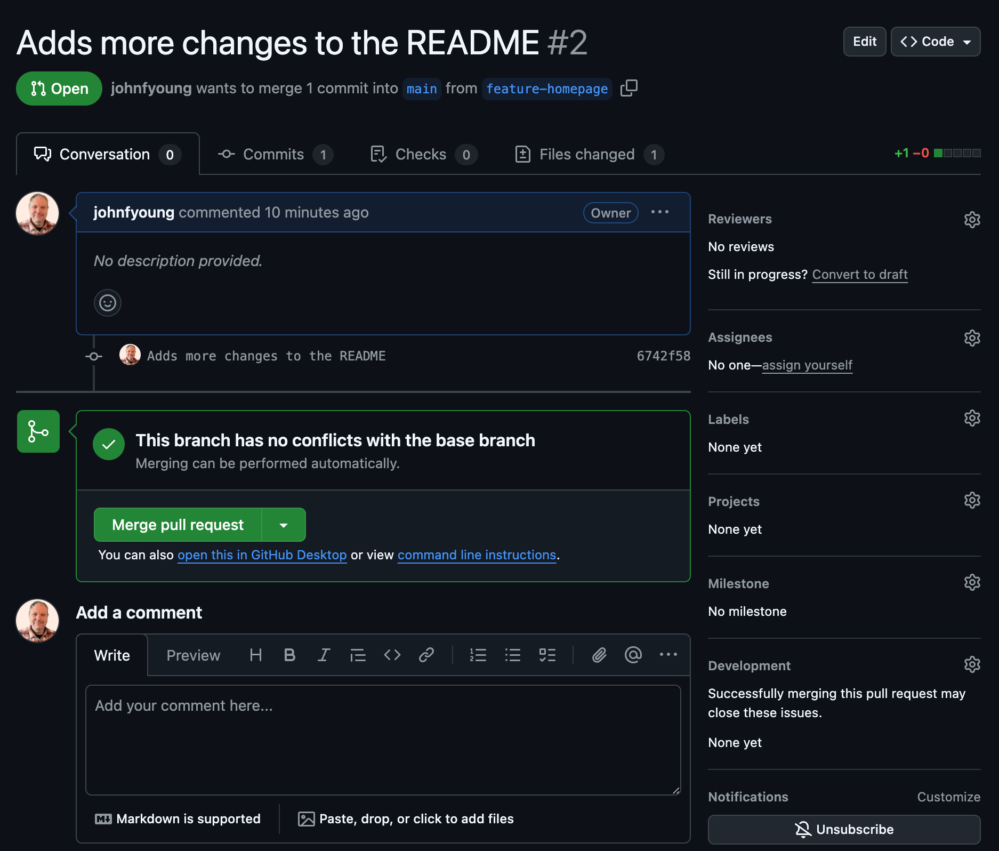

# Github Pull Request

Previously, we practiced creating a new feature branch, committing and pushing the work, and then merging the finished feature branch with the core codebase. That basic workflow makes sense for a small solo project, but what about larger projects, with multiple developers working on several features simultaneously? Luckily, Github's pull request feature accommodates team development work!

A **pull request** allows us to collaborate on features after they're finished and before they're merged into a development branch or main codebase. Once a feature branch is finished and ready for review, we can open a pull request and invite team members to review the code, comment on it, and even push their own commits. Pull requests not only provide a chance to catch bugs before merging but also enable developers to discuss new features and any necessary modifications before moving forward.

In this activity, you'll open a pull request for a feature branch. For now, you'll only leave comments on and review your own code. In future activities, you'll learn more about collaboration on GitHub and have the chance to work with others. Once the review is finished, you'll merge the pull request and delete the feature branch.

1. Make sure you are "in" your project folder and feature branch. Typing `git status` in your terminal should show you which branch you are in.
   
1. Make another change to the README (add something like "1. Adding another change in the feature branch...gonna do a pull request")
1. Add your change, commit it and push it
1. Go to your project on github and click out the "Pull Requests" menu
   
1. On the Pull Requests page, click on the green "New Pull Request" button
   
1. In the "compare" drop down, choose your feature branch
   
1. You will now see a comparison of changes to the main branch (since you last did a pull request from your branch) to the changes you just pushed up. If there are no conflicts you will see a green "Able to merge" message. Click the green "Create Pull Request" button.
   
1. You will now see the Open Pull Request page. This is an opportunity to summarize everything going into the pull request (which could span over many commits). Code is often reviewed by other teammates. A code review is also often a required step before the pull request can be merged into main.
   
1. Click "Create Pull Request". This will initiate a code comparison. Again if there are no conflicts, you will see a "Merge pull request" button.
   
1. Click "Merge pull request" and "Confirm Merge". Again, if code review requirements are added these steps will require another team member to review and confirem the code changes.
1. You should now see the results of your merge. At this point you could either delete the feature branch from github or return back to your local drive to continue working
   
