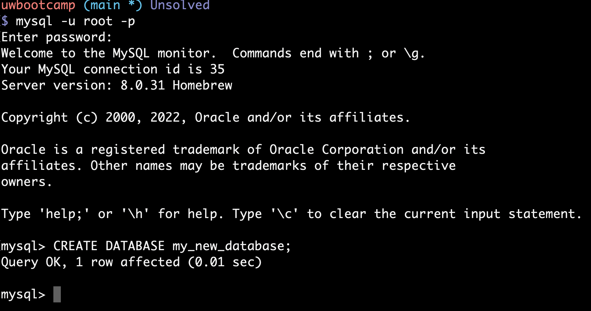

# How to execute SQL with MySQL

Developers write queries in Structured Query Language (SQL) that can create, retrieve, update or delete data from a database. MySQL is a Relational Database Managament System (RDBMS) that can execute SQL statements. To execute SQL in a MySQL system we need three things:

1. A MySQL server, either running remotely or locally at localhost
2. A client: some sort of software that can connect and send queries to the MySQL server.
3. A connection between the the client and the server

We have learned three ways to execute SQL in mysql.

1. **Directly in the `mysql` cli client**  
   You can connect to a MySQL Server by opening the `mysql` client with a user and password for the server. The default server host is localhost. Once connected, you can execute SQL on the command line.
   

1. **Sourcing a `.sql` file**  
   You can write your SQL queries in their own files. This is a common way to write longer or more commplex quereis in a text editor. We execute them by using a command in the `mysql` client:

```
source sqlFile.sql
```

One can also execute a SQL file outside the client directly from the shell:

```
mysql -u user -p < sqlFile.sql
```

1. **Within a Node application**  
   The `mysql2` npm package acts as a driver between `node` and the `mysqld` server. We use that package to connect, query and recieve data from a `mysql` database using javascript.
